<p align="center">
  
</p>

# BloodCare

A full-stack **blood donation and blood-request platform** built to connect donors, volunteers, members, blood banks, and people searching for blood.

This repository is one of my larger earlier full-stack projects. It combines a React frontend with an Express/MongoDB backend and adds real-time communication for urgent blood requests.

## What I built

The current codebase includes flows and routes for:

- user registration and login
- member and volunteer onboarding
- blood donation
- blood-request creation, listing, and detail views
- blood search
- blood-bank data
- nearby blood-bank discovery using map/geolocation tooling
- contact and informational pages
- events, media, news, tips, and vaccine information
- real-time Socket.IO connections
- browser notifications for new urgent blood requests
- backend health reporting

The backend exposes separate modules for authentication, contacts, volunteers, blood banks, blood inventory, blood requests, and members.

## Architecture

```text
React client
   │
   ├─ auth / members / volunteers
   ├─ blood search + requests
   ├─ nearby blood banks / maps
   └─ Socket.IO notifications
   │
Express API + Socket.IO
   │
   ├─ route/controller modules
   ├─ JWT-based auth dependencies
   └─ MongoDB / Mongoose
```

## Tech stack

**Frontend:** React 19, React Router, Axios, Bootstrap, Leaflet / React Leaflet, Socket.IO Client  
**Backend:** Node.js, Express 5, MongoDB, Mongoose, Socket.IO  
**Security-related dependencies:** bcryptjs, JSON Web Tokens, Helmet, rate limiting, Mongo sanitization, HPP, validation

## Repository structure

```text
BloodCare/
├── auth-frontend/   # React application
├── auth-backend/    # Express API + Socket.IO server
└── bloodcare        # legacy/project file
```

## Run locally

Frontend:

```bash
cd auth-frontend
npm install
npm start
```

Backend:

```bash
cd auth-backend
npm install
node server.js
```

The backend expects local environment configuration for values such as the MongoDB connection, authentication secrets, and the frontend origin.

## What this project taught me

This project pushed me beyond simple CRUD. It brought together **authentication, multiple domain entities, geospatial data, real-time events, browser notifications, and a larger frontend route surface** inside one product.

## Status

**Archive / learning project.** The repository documents a working full-stack build from an earlier stage of my development. Some dependencies and configuration patterns should be modernized before treating it as a production system.

---

**Sanam Rai** · [GitHub profile](https://github.com/SanamRai001)
